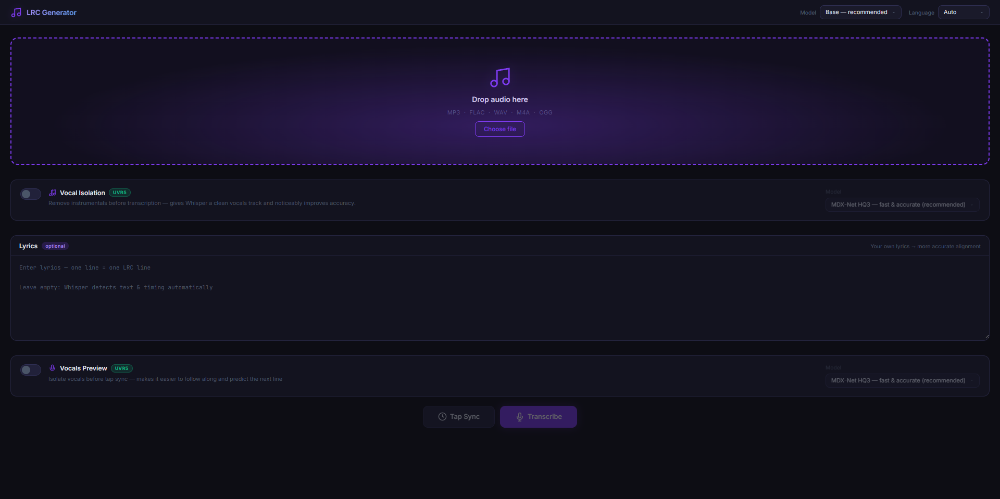
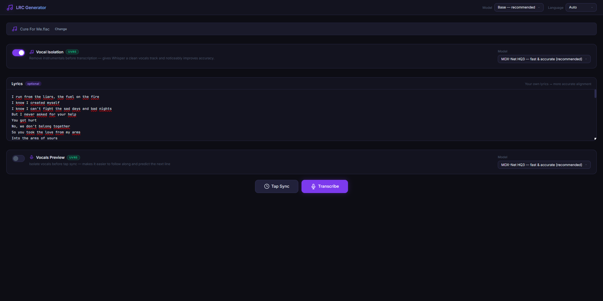
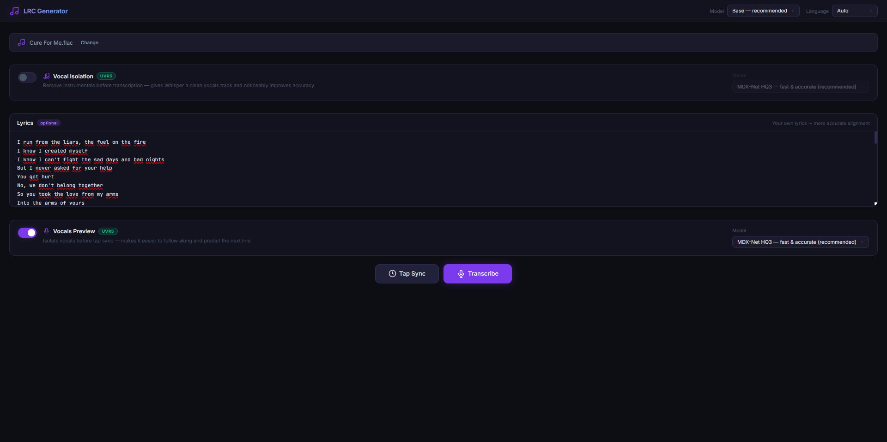
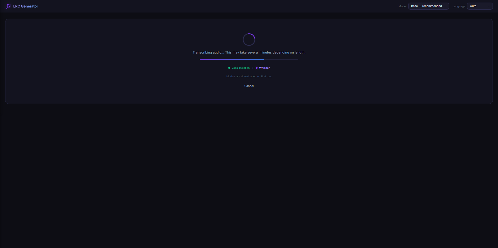
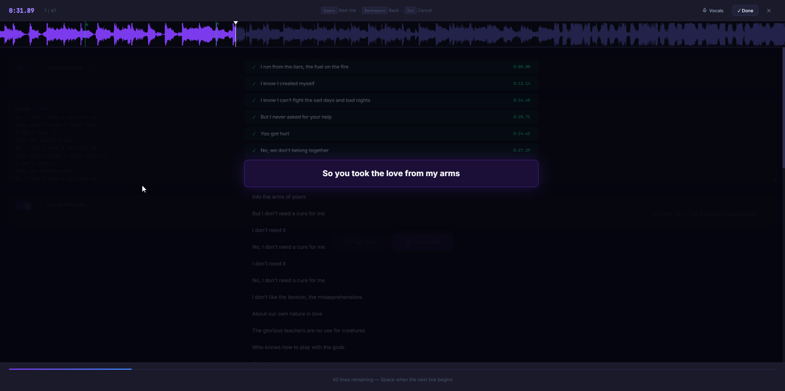
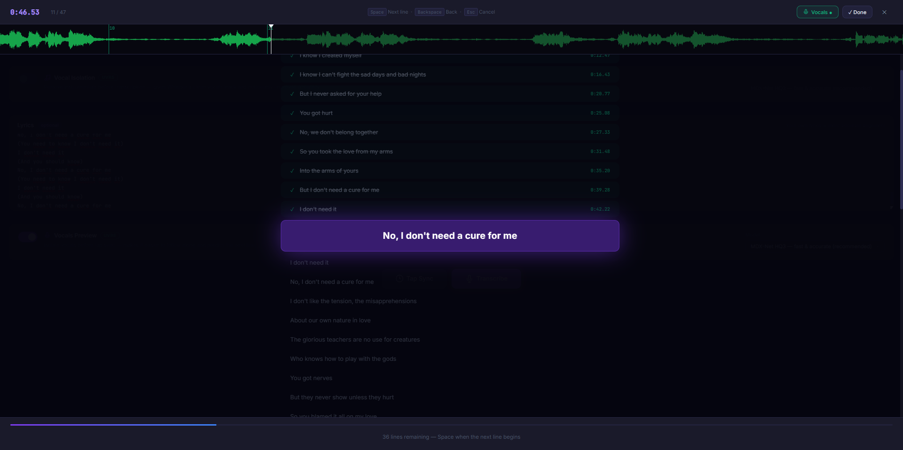
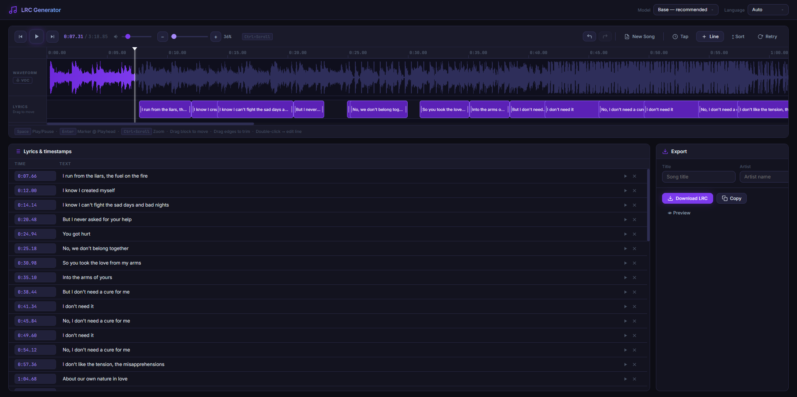
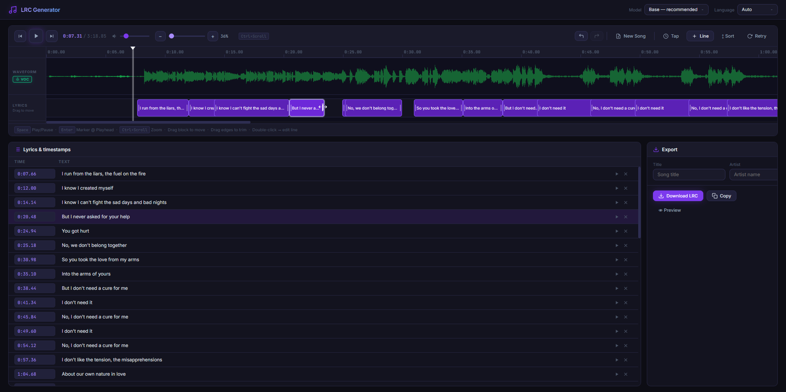

# LRCGen

**The first open-source, free, fully local AI + manual lyrics sync tool.**

Create perfectly timed `.lrc` karaoke files from any audio — using OpenAI Whisper for AI transcription, or tap along yourself line by line. No subscriptions. No cloud. Runs entirely on your machine.

---

## What it looks like

### 1. Home screen — drop your audio, choose your mode



Drop any audio file (MP3, FLAC, WAV, M4A, OGG) and choose how you want to generate your LRC:

- **Transcribe** — let Whisper AI detect text and timing automatically
- **Tap Sync** — tap along manually, line by line, in real time

Optionally paste your own lyrics into the text box — Whisper will align them to the audio instead of guessing the words, which gives you much more accurate results.

---

### 2. Vocal Isolation for Whisper — cleaner transcription



Enable **Vocal Isolation** (UVR5) before transcription. This strips out all instrumentals and gives Whisper a clean vocals-only track — noticeably improves accuracy on music with heavy backgrounds. Choose from 4 models depending on speed vs quality preference.

---

### 3. Vocals Preview for Tap Sync



When using Tap Sync, enable **Vocals Preview** — the UVR5 AI isolates the vocals first, so the waveform you tap along to shows only the vocal track instead of the full mix. Much easier to follow when the beat is loud.

---

### 4. Processing screen — Whisper + optional vocal isolation



While processing, a progress screen shows you exactly which stage is running — Vocal Isolation first, then Whisper transcription. Models are downloaded automatically on first use. You can cancel at any time.

---

### 5. Tap Sync — song waveform



The Tap Sync view shows every lyric line and a live scrolling waveform. The current line is highlighted in the center. Press **Space** to mark the start of the next line, **Backspace** to go back one step. The purple waveform here is the full song audio.

---

### 6. Tap Sync — isolated vocal waveform



Switch on Vocals Preview and the waveform turns **green** — now you're seeing (and hearing) only the isolated vocals. Individual words and phrases are much easier to follow, making it far simpler to tap at exactly the right moment.

---

### 7. Timeline editor — review and fine-tune



After Whisper or Tap Sync, every line appears in the **timeline editor**. You can:
- Drag blocks left/right to shift timing
- Drag edges to trim start/end of a segment
- Double-click any block to edit the text inline
- Add new lines at the playhead, delete unwanted ones
- Undo/Redo up to 80 steps

The full list of timestamps sits in the panel below. When you're happy, hit **Download LRC** or **Copy** on the right.

---

### 8. Timeline — vocal waveform + drag to adjust



Hit the **VOC** button next to the waveform track to switch to the isolated vocal waveform (green). Individual syllables become clearly visible, making precise timing adjustments easy. Drag any segment block to move it, or drag its edges to trim — exactly like a video editor.

The top bar gives you **New Song**, **Tap** (redo tap sync), **Retry** (re-run Whisper), and sort/undo controls.

---

## Quick Start

### 1. Install

```bat
install.bat
```

Then install PyTorch for your platform:

```bash
# CPU — works on any machine
pip install torch torchvision torchaudio

# NVIDIA GPU — much faster (recommended)
pip install torch torchvision torchaudio --index-url https://download.pytorch.org/whl/cu121
```

For GPU-accelerated vocal isolation:
```bash
pip install "audio-separator[gpu]"
```

### 2. Run

```bat
start.bat
```

Opens at `http://127.0.0.1:8000`

---

## Manual Installation

```bash
python -m venv venv
venv\Scripts\activate        # Windows
# source venv/bin/activate   # Linux/macOS

pip install fastapi "uvicorn[standard]" python-multipart openai-whisper
pip install "audio-separator[cpu]"
pip install torch torchvision torchaudio

python -m uvicorn app:app --host 127.0.0.1 --port 8000
```

---

## Keyboard Shortcuts

| Key | Action |
|-----|--------|
| `Space` | Play / Pause |
| `Enter` | Add segment at playhead |
| `←` / `→` | Seek ±2s |
| `Shift+←` / `Shift+→` | Seek ±10s |
| `Ctrl+Scroll` | Zoom in / out |
| `Ctrl+Z` | Undo |
| `Ctrl+Y` / `Ctrl+Shift+Z` | Redo |
| `Delete` | Delete selected segment |
| `↑` / `↓` | Navigate between segments |
| `Space` *(Tap Sync)* | Confirm current line, advance to next |
| `Backspace` *(Tap Sync)* | Go back one line |
| `Escape` *(Tap Sync)* | Cancel and close |

---

## Vocal Isolation Models (UVR5)

| Model | Speed | Best for |
|-------|-------|----------|
| MDX-Net HQ3 | Fast | General use — **recommended** |
| MDX-Net Voc_FT | Fast | Vocal-optimized tracks |
| MDX-Net KARA 2 | Fast | Karaoke tracks, cleanest output |
| Demucs htdemucs_ft | Slow | Best quality, complex mixes |

Models download automatically on first use (~100–300 MB each).

---

## Tech Stack

| Component | Library |
|-----------|---------|
| Backend | [FastAPI](https://fastapi.tiangolo.com/) |
| AI Transcription | [OpenAI Whisper](https://github.com/openai/whisper) |
| Vocal Isolation | [audio-separator](https://github.com/nomadkaraoke/python-audio-separator) (UVR5) |
| Waveform | [WaveSurfer.js](https://wavesurfer.xyz/) v7 |
| Deep Learning | [PyTorch](https://pytorch.org/) |
| Fonts | [Inter](https://rsms.me/inter/) + [JetBrains Mono](https://www.jetbrains.com/lp/mono/) |

---

## License

◿ This program is free ✓ software! ◺

◿ You can redistribute it and / or modify ◺

◁◅◃ it under the terms of the ▹▻▷

◹ GNU General Public License v3! ◸
